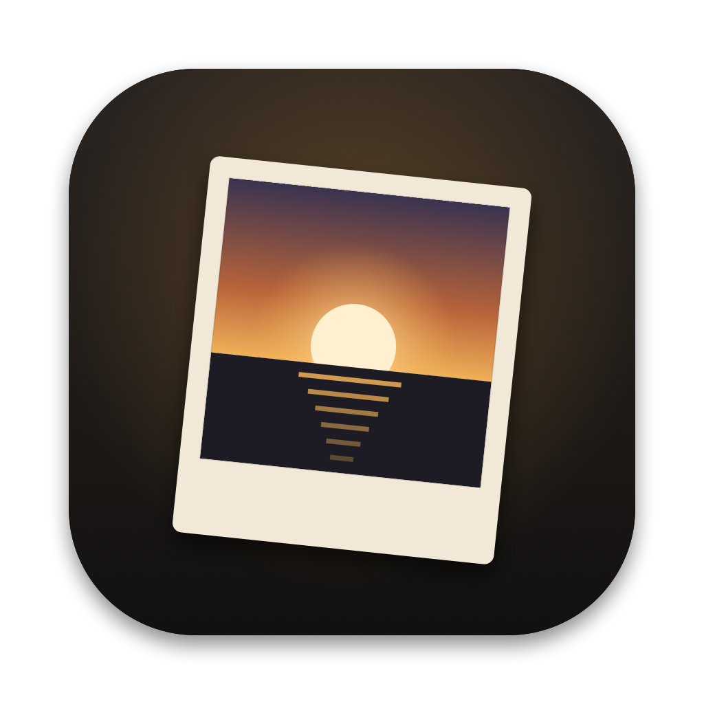

# Qwen Image Generator

极简的本地生图 GUI：在 Apple Silicon Mac 上运行 [Qwen-Image 2.1](https://github.com/QwenLM/Qwen-Image-2.1)。原生窗口、中文界面、一键下载模型，16 GB 内存的 MacBook Air 也能出图。

> 这是社区项目，与通义千问官方无关。



- **文生图 + 指令编辑**：放一张参考图，再写「把猫换成黑猫」这类指令就能改图
- **两个引擎**：[stable-diffusion.cpp](https://github.com/leejet/stable-diffusion.cpp)（默认，功能全）和 [MLX-Serve](https://github.com/ddalcu/mlx-serve)（实验，文生图更快）
- **模型管理**：贴链接下载任意模型（单个文件或整个 Hugging Face 仓库），断点续传，可切换国内镜像；自带推荐预设
- **切换模型**：生图模型、文本编码器、VAE、视觉组件各自可选，方便对比 Q4 / Q8 等不同量化
- **历史记录**：胶片条浏览、复用参数、当参考图继续改、删除（移到废纸篓）
- **零依赖**：后端只用 Python 标准库，界面是系统自带的 WebKit，不需要 pip / npm / Chrome

## 环境要求

| 项目 | 要求 |
|---|---|
| 芯片 | Apple Silicon（M1 及以后） |
| 内存 | 16 GB 起（4bit 模型、512 分辨率） |
| 系统 | macOS 15 或更新（用到系统自带的 `trash` 命令） |
| 工具 | Xcode 命令行工具（`xcode-select --install`），自带 Python 3.9 与 Swift 编译器 |
| 磁盘 | 基础套装约 11 GB |

## 安装

```bash
git clone https://github.com/227uijk/qwen-image-generator.git
cd qwen-image-generator
./build.sh
```

然后双击生成的 **`Qwen 生图.app`**。第一次打开时，macOS 可能会询问能否访问所在文件夹，点「允许」。

`.app` 启动时会在它**所在的文件夹**里找 `app.py`，所以整个文件夹要放在一起；想放进程序坞，直接把 `.app` 拖到程序坞即可。

也可以不打包，直接在浏览器里用：

```bash
python3 app.py      # 会自动打开 http://127.0.0.1:7861
```

## 下载模型

打开后点右上角「模型」，在「推荐预设」里点 **Qwen-Image 2.1 基础套装**，会依次下载：

| 文件 | 用途 | 大小 |
|---|---|---|
| sd.cpp 程序（macOS arm64） | 推理引擎 | 34 MB |
| `qwen_image_2.1-Q4_K.gguf` | 生图模型（DiT，4bit） | 4.2 GB |
| `Qwen3VL-8B-Instruct-Q4_K_M.gguf` | 文本编码器 | 5.0 GB |
| `qwen_image_2.1_vae_bf16.safetensors` | VAE | 0.7 GB |
| `mmproj-Qwen3VL-8B-Instruct-Q8_0.gguf` | 视觉组件（指令编辑需要） | 0.75 GB |

也可以把任意下载链接贴进「添加下载」：单个文件链接、`/blob/` 页面链接、或整个 Hugging Face 仓库地址都行。下载源可选 Hugging Face 原站（走系统代理）或国内镜像 hf-mirror。关掉工具后，未完成的任务下次打开会自动续传。

推荐预设写在 `app.py` 开头的 `PRESETS` 里，想加自己的模型直接改那里。

## 参数建议

以下是在 **M2 / 16 GB MacBook Air** 上实测得出的经验：

| 场景 | 建议 |
|---|---|
| 日常出图 | 512×512 或 512×768，**12 步**，CFG 1，不开加速 |
| 定稿 | 20 步以上；想要手部、文字更好用 CFG 3（时间翻倍）并填反向提示词 |
| 写实人像的手 | CFG 3 + 反向提示词「畸形的手, 多余的手指, 手指粘连」；Q8 模型更好 |
| 省内存模式 | 16 GB 机器保持开启（文本编码器从磁盘读，用完即释放） |
| 加速（EasyCache） | **默认关闭**。在 8–20 步时会明显发糊，只建议 30 步以上使用 |

实测速度（512×512，CFG 1，Q4 模型）：

| 引擎 | 每步 | 实测总耗时 | 峰值内存 |
|---|---|---|---|
| sd.cpp | ~13 秒 | 12 步约 4 分钟 | ~6 GB |
| MLX-Serve（实验） | ~9 秒 | 20 步约 3 分 20 秒 | ~8–10 GB |

总耗时里还包含加载模型、编码提示词和 VAE 解码，这部分与步数无关。

CFG 大于 1 时每步要算两遍，时间约翻倍。

## 两个引擎

**sd.cpp（默认）**：支持文生图和指令编辑，参数最全。工具里对它做了一处关键优化：Qwen 2.1 的 VAE 是 3D 卷积结构，在 Apple GPU 上很慢，所以强制放到 CPU 上解码（`--backend vae=cpu`），512 图的解码从约 110 秒降到约 35 秒，输出与 GPU 解码一致。

**MLX-Serve（实验）**：需要在预设里下载「MLX 引擎套装」（程序 72 MB + 模型包 10.7 GB）。每次出图时临时启动、出完即关，并关闭了它在 16 GB 机器上过于保守的内存检查（`--max-resident-mem 0 --skip-mem-preflight`）。目前 MLX-Serve 的 Qwen 2.1 **不支持指令编辑**，放参考图时请切回 sd.cpp；省内存和加速开关对它无效。

## 目录结构

```
app.py            后端：HTTP 服务、下载队列、调用引擎
index.html        界面
launcher/         原生窗口外壳（Swift）与图标
build.sh          打包 .app
models/           模型（自动识别用途，也可在「模型管理」里手动改）
bin/              引擎程序
outputs/          生成的图片
```

运行时状态保存在 `settings.json`（选中的模型）、`history.json`（历史）、`downloads.json`（下载队列），都已加入 `.gitignore`。

## 常见问题

**打开后界面一直空白？** 看同目录的 `app.log`。多半是第一次运行时没有允许访问文件夹，或者 7861 端口被占用。

**提示内存不足、生成失败？** 关掉浏览器、聊天客户端等占内存的软件；16 GB 机器建议先用 512 分辨率。

**模型放进 `models/` 但没识别出来？** 在「模型管理」里把它的用途改成对应类型即可。

## 许可

本工具代码以 [MIT 许可](LICENSE) 发布。

**模型不属于本仓库**，由各自作者以各自许可发布。Qwen-Image 2.1 使用 [Qwen Research License](https://huggingface.co/Qwen/Qwen-Image-2.1/blob/main/LICENSE)，**仅限非商业研究与评估**，商用需另行向通义千问团队申请。下载和使用模型前请自行阅读对应许可。

## 致谢

- [Qwen-Image 2.1](https://github.com/QwenLM/Qwen-Image-2.1) — 通义千问团队
- [stable-diffusion.cpp](https://github.com/leejet/stable-diffusion.cpp) 与 [leejet/Qwen-Image-2.1-GGUF](https://huggingface.co/leejet/Qwen-Image-2.1-GGUF)
- [MLX-Serve](https://github.com/ddalcu/mlx-serve) 与 [ddalcu/Qwen-Image-2.1-MLX-Serve-4bit](https://huggingface.co/ddalcu/Qwen-Image-2.1-MLX-Serve-4bit)
- [Comfy-Org/Qwen-Image-2.1](https://huggingface.co/Comfy-Org/Qwen-Image-2.1)（VAE）
